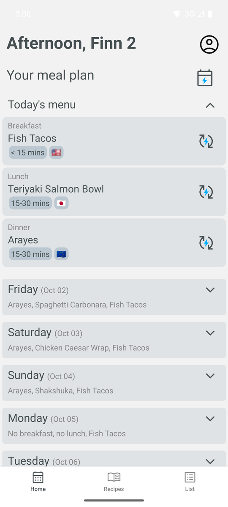
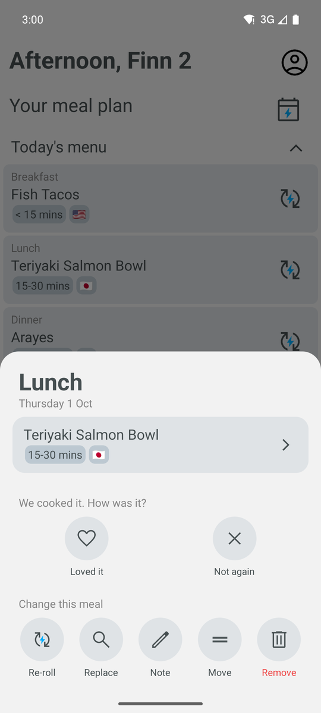
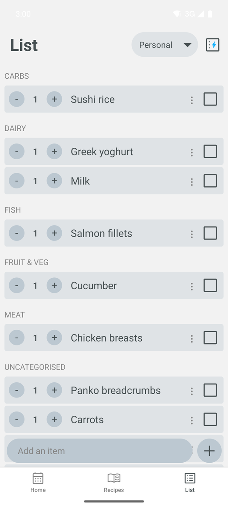
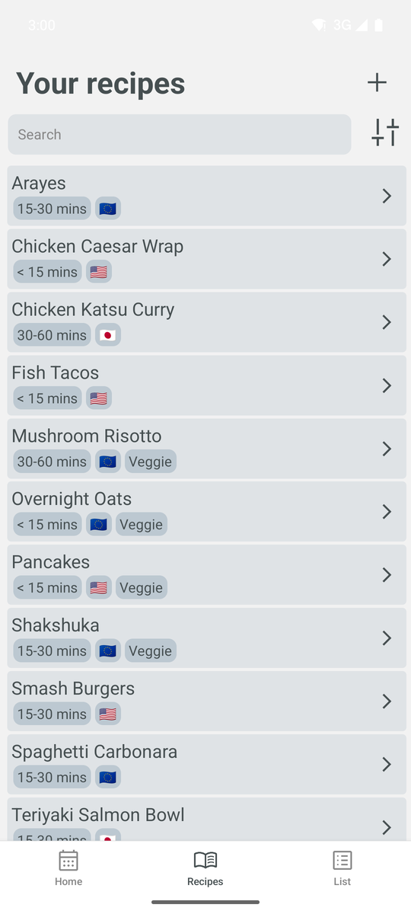
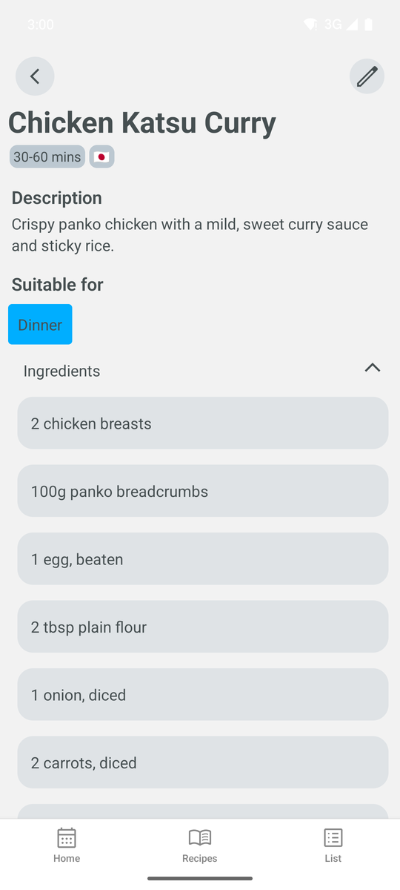
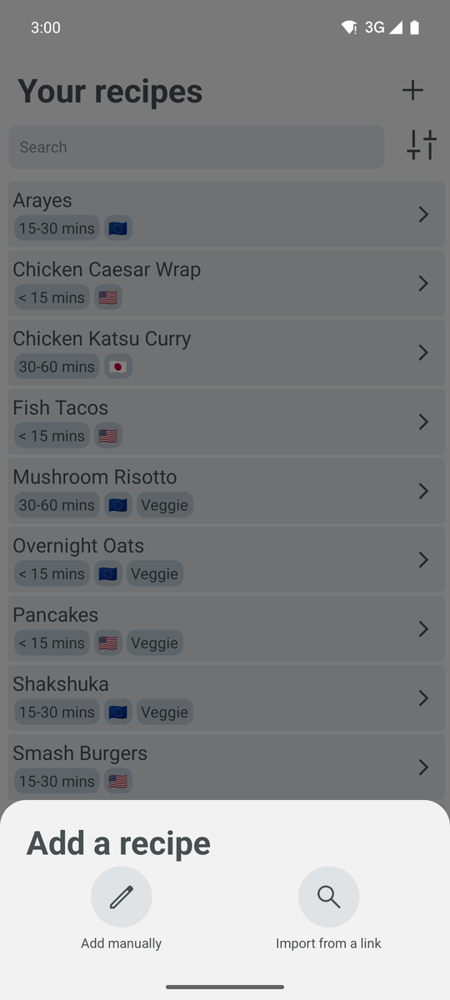

  <picture>
    <source media="(prefers-color-scheme: dark)" srcset="readme_assets/sous_transparent_dark.png">
    
    </picture>
  
Your personal meal planning assistant.

---

## 📖 About

*Sous* is a project inspired by the myriad of meal planning apps that seem very expensive for very basic functionality. It's built for personal use by myself and my girlfriend: we share one household, one meal plan and one shopping list.

## ✨ Features

- **Meal plan:** see today's menu and the days ahead. Tap a meal to open its recipe, re-roll or replace it, move it to another day (swapping with whatever is there), remove it, or add a note such as eating out, leftovers or a takeaway.
- **Suggestions that learn your taste:** tap ⚡ on an empty slot for a suggestion, or re-roll one you don't fancy. Suggestions are ranked by how similar each recipe is to what you've kept, cooked and rated, using text embeddings stored in Postgres (pgvector).
- **Generate a plan:** fill every empty slot across a date range in one go, respecting which meals (breakfast, lunch, dinner) you plan for.
- **"We cooked it":** after a meal, mark it "Loved it" or "Not again"; ratings feed back into future suggestions. Past meals are kept in your meal history.
- **Recipes:** add your own, with ingredients, method, photo, cooking time, cuisine, diet and which meals it suits. Search and filter your collection.
- **Import from a link:** paste a recipe URL and Sous fills in the name, ingredients, method and photo. If a site blocks the import, open it in the in-app browser and import from there.
- **Shopping lists:** generate a list from the meals planned in a date range, with items sorted into categories. Add your own items and tick them off as you shop.
- **Sharing:** invite your partner by email to share recipes, the meal plan and shopping lists.
- **Preferences:** set your diet, allergies, dislikes and usual portion size during onboarding or later in your profile.
- **Cross-platform:** Android and iOS.

## 📸 Screenshots

| Meal plan | Meal options | Shopping list |
| :---: | :---: | :---: |
|  |  |  |

| Recipes | Recipe | Add a recipe |
| :---: | :---: | :---: |
|  |  |  |

## 🛠️ Technologies Used

- **Frontend:** [React Native](https://reactnative.dev/) with [Expo](https://expo.dev/)
- **Backend:** [Supabase](https://supabase.io/)
- **Navigation:** [React Navigation](https://reactnavigation.org/)
- **Suggestions:** [Supabase Edge Functions](https://supabase.com/docs/guides/functions) (`gte-small` embeddings) and [pgvector](https://github.com/pgvector/pgvector)
- **UI:** Custom components with a focus on a clean and minimal design.

## 📲 Installing

- **Android:** build an APK with `eas build -p android --profile preview-apk` and install it directly.
- **iOS (sideload):** run the **Build unsigned iOS** workflow, then **Publish release**, in GitHub Actions. In [AltStore](https://altstore.io) or [SideStore](https://sidestore.io), add this source:
  `https://github.com/finnbichan/sous/releases/latest/download/altstore-source.json`

